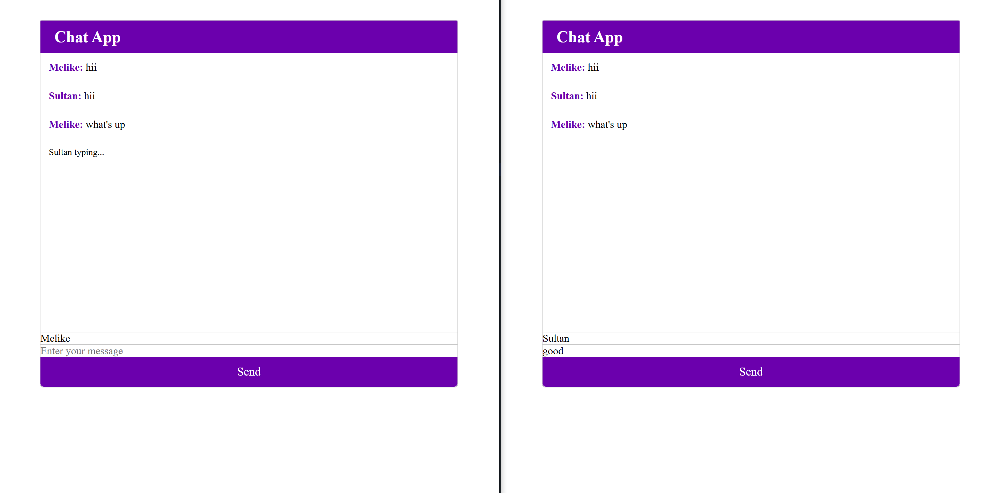

# ChatApp using Socket.io 
This is a simple chat system implemented using Socket.io and Node.js. The project provides a real-time messaging platform where users can communicate with each other in a single room.

## Technologies Used
**```Socket.io:```** A JavaScript library for real-time, bidirectional communication between web clients and servers.  
**```Node.js:```** A JavaScript runtime environment that allows running JavaScript on the server-side.  
**```Express.js:```** A fast and minimalist web application framework for Node.js.  
**```HTML/CSS:```** The standard markup language and styling for building the user interface.  
**```Git:```** A version control system for tracking changes in the project.  

## Getting Started
To run the chat app locally, follow these steps:  

1. Clone the repository:  ```https://github.com/melikeebozoglan/ChatApp.git```  
2. Install the dependencies:  ```npm install```  
3. Start the server:  ```node server.js```  
4. Access the chat system in your web browser:  ```http://localhost:3000```  

## Project Interface

